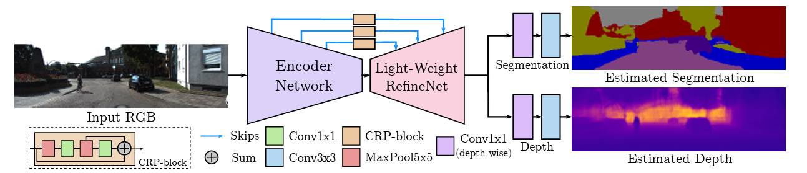
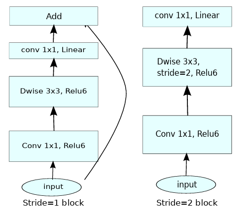
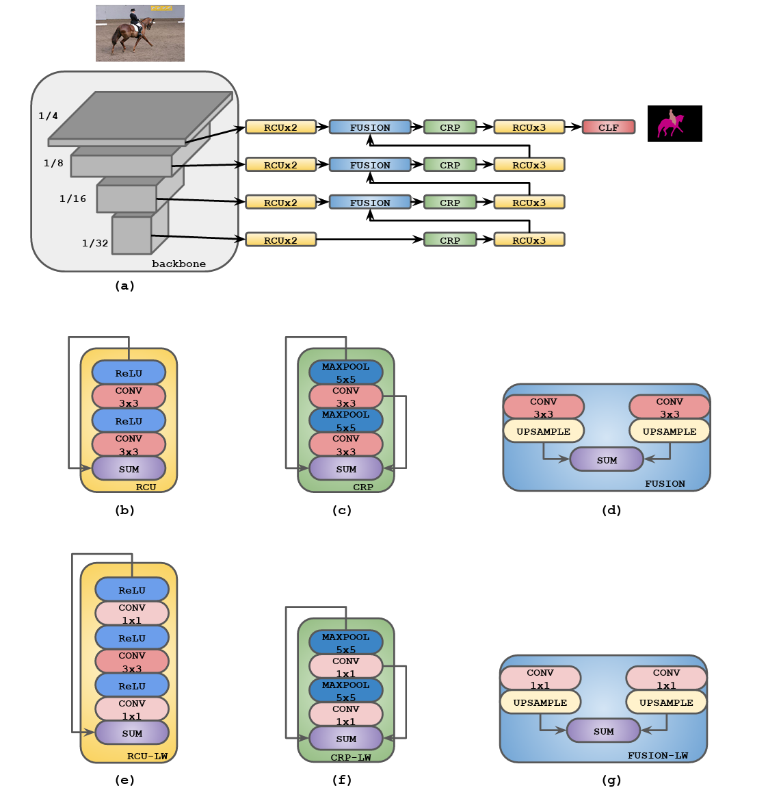
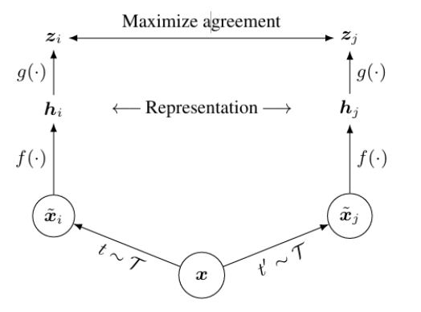
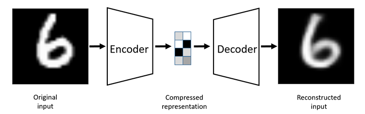
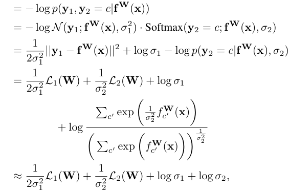

# Multi-Task Learning for Real-Time Segmentation and Depth Estimation

This project implements a multi-task learning pipeline on the NYUv2 dataset using:

- **Encoder pretrained via multi-scale dense pixel-wise SimCLR contrastive learning**
- **Decoder pretrained via RGB autoencoder reconstruction**
- **Learnable task uncertainty loss weighting (Kendall et al., 2018)**
- **Cosine annealing learning rate scheduling with warmup**
- **MobileNetV2-based encoder and lightweight RefineNet decoder**

---

## Features

- Lightweight MobileNetV2 encoder
- Efficient RefineNet-style decoder
- Semantic segmentation and depth estimation
- Optional encoder freezing for warm-up
- Plots for loss, mIoU, and RMSE

---

## Network Architecture



*Figure 1 – General network structure for joint semantic segmentation and depth estimation. The architecture uses a MobileNetV2 encoder and a lightweight RefineNet decoder, where each task has only two specific parametric layers. CRP blocks and skip connections enable efficient multi-task fusion for semantic segmentation and depth estimation.*

📖 **Citation:**  
V. Nekrasov, T. Dharmasiri, A. Spek, T. Drummond, C. Shen and I. Reid,  
**"Real-Time Joint Semantic Segmentation and Depth Estimation Using Asymmetric Annotations,"**  
_2019 International Conference on Robotics and Automation (ICRA)_, Montreal, QC, Canada, 2019, pp. 7101–7107.  
[https://doi.org/10.1109/ICRA.2019.8794220](https://doi.org/10.1109/ICRA.2019.8794220)


## Encoder Architecture



*Figure – MobileNetV2 encoder used for extracting efficient low-level and high-level image features. It is lightweight and well-suited for real-time applications.*

📖 **Citation:**  
Mark Sandler, Andrew Howard, Menglong Zhu, Andrey Zhmoginov, and Liang-Chieh Chen,  
**"MobileNetV2: Inverted Residuals and Linear Bottlenecks,"**  
*arXiv preprint arXiv:1801.04381*, 2018.  
[https://doi.org/10.48550/arXiv.1801.04381](https://doi.org/10.48550/arXiv.1801.04381)

## Decoder Architecture



*Figure – Lightweight RefineNet decoder architecture used for upsampling and multi-scale feature fusion. It integrates CRP blocks and skip connections for efficient semantic and depth decoding.*

📖 **Citation:**  
Vladimir Nekrasov, Chunhua Shen, and Ian Reid,  
**"Light-Weight RefineNet for Real-Time Semantic Segmentation,"**  
*arXiv preprint arXiv:1810.03272*, 2018.  
[https://doi.org/10.48550/arXiv.1810.03272](https://doi.org/10.48550/arXiv.1810.03272)

## SimCLR Pretraining



*Figure – Pretraining pipeline for the encoder using pixel-wise dense contrastive learning (SimCLR). This helps the encoder learn generalizable representations from unlabeled RGB data.*

📖 **Citation:**  
Ting Chen, Simon Kornblith, Mohammad Norouzi, and Geoffrey E. Hinton,  
**"A Simple Framework for Contrastive Learning of Visual Representations,"**  
*arXiv preprint arXiv:2002.05709*, 2020.  
[https://arxiv.org/abs/2002.05709](https://arxiv.org/abs/2002.05709)

## Autoencoder Pretraining



*Figure – Decoder pretraining using a standard RGB autoencoder setup, encouraging effective reconstruction-based feature decoding.*

📖 **Citation:**  
Dor Bank, Noam Koenigstein, and Raja Giryes,  
**"Autoencoders,"**  
*arXiv preprint arXiv:2003.05991*, 2020.  
[https://doi.org/10.48550/arXiv.2003.05991](https://doi.org/10.48550/arXiv.2003.05991)

## Uncertainty Loss Weighting



*Figure – Multi-task loss balancing using learnable uncertainty weights (Kendall et al., 2018), which allows each task to adaptively adjust its contribution to the total loss during training.*

📖 **Citation:**  
A. Kendall, Y. Gal, and R. Cipolla,  
**"Multi-task Learning Using Uncertainty to Weigh Losses for Scene Geometry and Semantics,"**  
_CVPR 2018_  
[https://arxiv.org/abs/1705.07115](https://arxiv.org/abs/1705.07115)

---


## Directory Overview

```
MTL1_Pretrained_Model
├── autoencoder.py            # HydraAutoencoder for decoder pretraining
├── simclr.py                 # SimCLR encoder pretraining
├── hydranet.py               # HydraNet model architecture
├── scheduler.py              # Learning rate schedulers
├── dataset.py                # Dataset handling (NYUv2)
├── utils.py                  # Losses, metrics, and visualizations
├── model_helpers.py          # Model loading, saving utilities
├── train_list_depth.txt      # Training split
├── val_list_depth.txt        # Validation split
├── test_list_depth.txt       # Testing split
├── cmap_nyud.npy             # Color map for segmentation
├── req.txt                   # Python environment dependencies
├── pretrained_autocoder_main.py # Script for autoencoder training
├── args.json                 # Arguments for reproducibility
├── baseline_result/          # Stores pretrained checkpoints & metric logs
└── weights/                  # Pretrained weights
```

```
MTL2_Training
├── main.py                  # Fine-tuning entry point
├── hydranet.py              # Full HydraNet model
├── dataset.py               # Dataset loading and transforms
├── scheduler.py             # Cosine annealing + warmup
├── utils.py                 # Metric functions (mIoU, RMSE)
├── model_helpers.py         # Checkpoint management
├── merge_shuff.py           # Data splitting utility
├── args.json                # Training arguments
├── weights/                 # Contains pretrained encoder & decoder
├── baseline_result/         # Logs: training_loss, miou, rmse
├── cmap_nyud.npy            # Color palette
├── train_list_depth.txt     # Training split
├── val_list_depth.txt       # Validation split
├── test_list_depth.txt      # Testing split
├── download_dataset.sh      # Auto-download NYUv2 dataset
```
---

## Setup

**Requirements:**

- Python 3.8+
- PyTorch ≥ 1.10
- torchvision
- numpy, matplotlib, Pillow, tqdm

```bash
conda env create -f environment.yml
```

---

## Pretraining

### 1. Pretrain Encoder (SimCLR)

```bash
cd ./MTL1_Pretrained_Model
CUDA_VISIBLE_DEVICES=4 python ./main.py --lr_enc 1e-2 --max_iter 10000 --cas_warmup_steps_enc 300 --cas_min_lr_enc 9e-5 --cas_T_0_enc 10000 --out_chkpt_file ./pretrained_full_320_256_epoch10000_multiscale_dense/pretrained_full.320_256.epoch10000.multiscale_dense.pth.tar --out_encoder_chkpt_file pretrained_hydranet_encoder.320_256.epoch10000.multiscale_dense.pth.tar --out_pretrain_loss_file ./pretrained_full_320_256_epoch10000_multiscale_dense/pretrained_full.320_256.epoch10000.multiscale_dense.loss_file.npz --out_pretrain_loss_figfile_name pretrained_full.320_256.epoch10000.multiscale_dense.loss_fig.png --out_dir ./pretrained_full_320_256_epoch10000_multiscale_dense --load_init 1 --load_resume 0 --batch_size 32

CUDA_VISIBLE_DEVICES=0 python ./main.py --load_init 1 --load_resume 0 --out_chkpt_file ./weights/pretrained_all.320_256.multiscale_dense.pth.tar --out_encoder_chkpt_file ./weights/pretrained_hydranet_encoder.320_256.multiscale_dense.pth.tar --out_pretrain_loss_file ./weights/pretrained_loss_file.320_256.multiscale_dense.npz  --out_pretrain_loss_figfile_name ./weights/pretrained_loss_fig.320_256.multiscale_dense.png  --lr_enc 6e-4 --max_iter 5000 --cas_warmup_steps_enc 300 --cas_T_0_enc 8000 --cas_min_lr_enc 2e-4 --cas_final_lr_enc 1e-5

```

### 2. Pretrain Decoder (Autoencoder)

```bash
cd ./MTL1_Pretrained_Model
CUDA_VISIBLE_DEVICES=3 python ./pretrain_autoencoder_main.py --lr_enc 8e-4 --max_iter 10000 --cas_warmup_steps_enc 500 --cas_min_lr_enc 9e-5 --cas_T_0_enc 10000 --out_full_autoencoder_chkpt_file ./pretrained_full_autoencoder_epoch10000/pretrained_full.autoencoder.epoch10000.pth.tar --out_encoder_chkpt_file pretrained_hydranet_encoder.autoencoder.epoch10000.pth.tar --out_decoder_chkpt_file pretrained_hydranet_decoder.autoencoder.epoch10000.pth.tar --out_pretrain_loss_file ./pretrained_full_autoencoder_epoch10000/pretrained_hydranet_encoder.autoencoder.epoch10000.loss_file.npz --out_pretrain_loss_figfile_name pretrained_hydranet_encoder.autoencoder.epoch10000.loss_fig.png --out_dir ./pretrained_full_autoencoder_epoch10000/ --load_init 1 --load_resume 0 --batch_size 32
```

---

## Multi-Task Training

```bash
cd ./MTL2_Training
CUDA_VISIBLE_DEVICES=3 python ./main.py --lr_enc 1e-4 --cas_min_lr_enc 8e-5 --cas_final_lr_enc 3e-6 --lr_dec 3e-4 --cas_min_lr_dec 1e-5 --cas_final_lr_dec 7e-6 --cas_warmup_steps_enc 50 --cas_warmup_steps_dec 180 --max_iter 2301 --cas_T_0_enc 1000 --cas_T_0_dec 1000 --load_init 1 --load_pretrained 1 --load_resume 0 --init_chkpt_file_enc ../MTL1_Pretrained_Model/weights/pretrained_hydranet_encoder.320_256.multiscale_dense.pth.tar --out_chkpt_file checkpoint.pretrained.encoder_multiscale_dense.decoder_rand.pth.tar --val_every 100 --freeze_enc_epoch 50 --output_dir ./pretrain_multiscale_dense_enc_rand_dec4 --batch_size 4 --use_uncloss_weight --weight_decay_enc 1e-4 --weight_decay_dec 2e-4 --final_linear_decay --invhuber_weight 1.0 --l1_weight 0.0 --grad_weight 0.0

CUDA_VISIBLE_DEVICES=3 python ./main.py --lr_enc 1.2e-4 --cas_min_lr_enc 8e-5 --cas_final_lr_enc 1e-5 --lr_dec 4e-4 --cas_min_lr_dec 1e-4 --cas_final_lr_dec 1e-5 --cas_warmup_steps_enc 100 --cas_warmup_steps_dec 180 --max_iter 2301 --cas_T_0_enc 300 --cas_T_0_dec 300 --load_init 1 --load_pretrained 1 --load_resume 0 --init_chkpt_file_enc ../MTL1_Pretrained_Model/pretrained_full_320_256_epoch10000_multiscale_dense/pretrained_hydranet_encoder.320_256.epoch10000.multiscale_dense.pth.tar --out_chkpt_file checkpoint.pretrained.encoder_multiscale_dense.decoder_rand.pth.tar --val_every 100 --freeze_enc_epoch 30 --lr_sigma_seg 5e-4 --cas_min_lr_sigma_seg 5e-5 --cas_final_lr_sigma_seg 1e-5 --lr_sigma_depth 5e-4 --cas_min_lr_sigma_depth 5e-5 --cas_final_lr_sigma_depth 1e-5 --cas_warmup_steps_sigma_seg 100 --cas_warmup_steps_sigma_depth 100 --cas_T_0_sigma_seg 400 --cas_T_0_sigma_depth 400 --output_dir ./pretrain_multiscale_dense_enc_rand_dec5 --batch_size 4 --final_linear_decay --use_uncloss_weight --weight_decay_enc 2e-4 --weight_decay_dec 3e-4 --invhuber_weight 1.0 --l1_weight 0.0 --grad_weight 0.0

CUDA_VISIBLE_DEVICES=3 python ./main.py --lr_enc 1e-4 --cas_min_lr_enc 8e-5 --cas_final_lr_enc 3e-6 --lr_dec 2e-4 --cas_min_lr_dec 1e-5 --cas_final_lr_dec 7e-6 --cas_warmup_steps_enc 50 --cas_warmup_steps_dec 180 --max_iter 2301 --cas_T_0_enc 1000 --cas_T_0_dec 1000 --load_init 1 --load_pretrained 1 --load_resume 0 --init_chkpt_file_enc ./MTL1_Pretrained_Model/weights/pretrained_hydranet_encoder.320_256.multiscale_dense.pth.tar --out_chkpt_file checkpoint.pretrained.encoder_multiscale_dense.decoder_rand.pth.tar --val_every 100 --freeze_enc_epoch 50 --output_dir ./pretrain_multiscale_dense_enc_rand_dec6 --batch_size 4 --use_uncloss_weight --weight_decay_enc 2e-4 --weight_decay_dec 3e-4 --final_linear_decay --invhuber_weight 1.0 --l1_weight 0.0 --grad_weight 0.0
```

---

## Visualization

Under folder `baseline_result`:

- `training_validation_loss.png`: training/validation loss curves
- `miou_rmse_metrics.png`: validation mIoU and RMSE trends

---

## Evaluation Metrics

| Metric | Description        |
|--------|--------------------|
| mIoU   | Mean Intersection over Union (segmentation) |
| RMSE   | Root Mean Square Error (depth)              |

| Configure  | mIoU               | RMSE    |
|------------|--------------------|---------|
| all rand   |   0.234370         |1.270228 |
| enc: pretrain 5000 epoch + dec: rand   | 0.302248   | 1.160535 |
| enc: pretrain 10000 epoch + dec: rand + uncertainty weighted loss  | 0.304979  | 1.152711 |
| enc: pretrain 10000 epoch + dec: autoencoder + uncertainty weighted loss   | 0.243688 |1.172928|
| enc: pretrain 10000 epoch + dec: rand + uncertainty weighted loss + weighted invhuber+L1+Grad Loss | Coming Soon | Coming Soon |

---

## Demo Video

▶️ [](https://youtu.be/UL70NAWl24E)

---

## Notes

- Segmentation: `num_classes=40`
- You can freeze the encoder for the first 200 epochs via setting --freeze_enc_epoch 200:

```python
if epoch < args.freeze_enc_epoch:
    freeze_encoder()
```

Adjust based on loss curves or encoder drift.

---

## Citation

```bibtex
@inproceedings{kendall2018multi,
  title={Multi-task Learning Using Uncertainty to Weigh Losses for Scene Geometry and Semantics},
  author={Kendall, Alex and Gal, Yarin and Cipolla, Roberto},
  booktitle={CVPR},
  year={2018}
}
```
